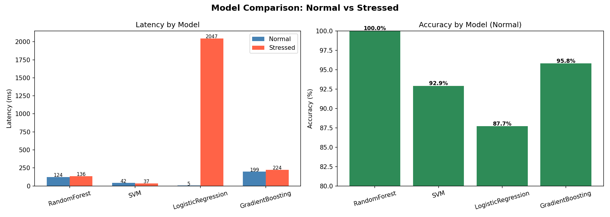
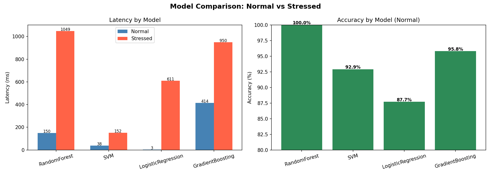

# ML Benchmark Tool

A command-line tool that benchmarks ML model performance while capturing
live Linux system metrics (CPU, RAM, frequency). Discovers how different
models behave under CPU and memory stress conditions.

Built with Python, psutil, scikit-learn, pandas, and matplotlib on Ubuntu Linux.

---
## Project Structure

```
ml_benchmark/
├── collector.py      — reads live Linux system metrics using psutil
├── benchmark.py      — runs ML workloads, stress tests, CLI interface
├── reporter.py       — saves results to CSV and generates charts
├── results.csv       — benchmark data output
├── report.png        — latency and system metrics chart
├── model_report.png  — CPU stress model comparison chart
└── memory_stress_report.png — memory stress model comparison chart
```
---

## Usage

```bash
# Basic run
python3 benchmark.py --runs 5

# With report output
python3 benchmark.py --runs 5 --report

# Compare normal vs CPU stressed
python3 benchmark.py --compare --runs 5 --report

# Compare all models normal vs CPU stressed
python3 benchmark.py --compare-models --runs 3 --report

# Compare all models under memory pressure
python3 benchmark.py --memory-stress --runs 3 --report
```

---

## Key Findings

### CPU Stress Results


| Model              | Normal | Stressed | Slowdown  |
|--------------------|--------|----------|-----------|
| LogisticRegression | 5.5ms  | 2047ms   | +37,253%  |
| RandomForest       | 123ms  | 136ms    | +10.5%    |
| GradientBoosting   | 199ms  | 224ms    | +12.7%    |
| SVM                | 41ms   | 36ms     | -12.2%    |

**Why:** LogisticRegression uses an iterative solver — thousands of
sequential steps that each get delayed under CPU contention, and the
delays stack up. RandomForest builds trees in parallel so one delayed
thread doesn't block the others.

---

### Memory Stress Results


| Model              | Normal | Stressed | Slowdown  |
|--------------------|--------|----------|-----------|
| RandomForest       | 149ms  | 1049ms   | +600%     |
| LogisticRegression | 3.2ms  | 610ms    | +19,226%  |
| SVM                | 38ms   | 152ms    | +297%     |
| GradientBoosting   | 414ms  | 949ms    | +129%     |

**Why:** RandomForest builds 50 trees simultaneously, each holding its
own data in RAM. Under memory pressure it constantly swaps data in and
out — called thrashing. GradientBoosting builds trees one at a time so
it only needs one tree worth of RAM at any moment.

---

### Conclusion

> The fastest model in ideal conditions can be the slowest in production.
> Always benchmark under realistic system conditions.

| If your server is...     | Best model choice  |
|--------------------------|--------------------|
| CPU constrained          | GradientBoosting   |
| Memory constrained       | GradientBoosting   |
| Ideal conditions         | LogisticRegression |
| Unknown / variable load  | GradientBoosting   |

---

## Requirements

```bash
pip3 install transformers psutil pandas matplotlib scikit-learn
sudo apt install stress-ng
```

---

## What I learned

- Linux system metrics (CPU, RAM, frequency) using psutil
- Real benchmarking methodology — p95, stdev, multiple runs
- How CPU and memory contention affect different ML algorithms differently
- subprocess, argparse, dataclasses — advanced Python patterns
- matplotlib headless rendering for Linux servers
- Git workflow end to end
